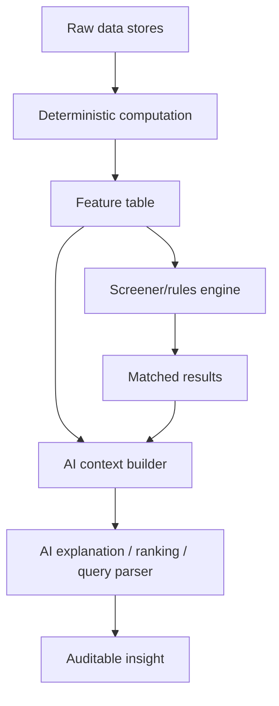

# AI Approach From First Principles

Last updated: 2026-05-12

## First Principles

The app should not ask AI to “predict stocks” directly. That is too unconstrained and too easy to overfit. The better design is to make AI operate on explicit market facts, transparent calculations, and auditable assumptions.

Core principles:

- Market data is observed, not invented.
- Indicators are deterministic transformations of data.
- Recommendations are hypotheses, not orders.
- Every AI output must reference the input signals it used.
- The app must separate signal generation from trade execution.
- AI should reduce cognitive load, not hide uncertainty.

## Data Layers

AI should work over layered data:

1. Raw data:
   - OHLCV candles.
   - LTP/OHLC quotes.
   - OI, PCR, OI buildup where available.
   - Instrument metadata.
   - Locally stored snapshots.
   - External fundamentals, news, and mutual-fund data if added.

2. Derived data:
   - Daily, weekly, fortnightly, monthly, quarterly, 6M, 1Y deltas.
   - Moving averages.
   - RSI.
   - Volume ratios.
   - Range and gap metrics.
   - Sector relative strength.
   - Distance from high/low.
   - Snapshot deltas.

3. Interpretive data:
   - “Sector leading market.”
   - “Stock diverging from sector.”
   - “Volume expansion without price confirmation.”
   - “Index breadth weakening.”
   - “Move possibly news-linked.”

AI should only operate on layer 3 after layers 1 and 2 are computed by code.

## AI Use Cases

### 1. Screener Explanation

Input:

- Screener formula.
- Matched instruments.
- Indicator values.
- Period deltas.
- Benchmark/sector comparison.

Output:

- Plain-English explanation of why each instrument matched.
- Signal strengths and weaknesses.
- Missing data warnings.
- Suggested follow-up checks.

Example:

```text
NIFTY PHARMA matched because it is above SMA50, weekly momentum is positive, and RSI is not overextended. The weak point is low volume expansion, so this is a watchlist candidate rather than a high-conviction signal.
```

### 2. Sector Rotation Detection

Goal:

Find where money appears to be moving across sectors.

Method:

1. Compute sector/index deltas for daily, weekly, monthly, quarterly, 6M, and 1Y.
2. Rank each sector by each window.
3. Detect rank acceleration:
   - Daily rank much better than monthly rank.
   - Weekly rank improving versus quarterly rank.
   - Sector outperforming NIFTY 50 over multiple windows.
4. Ask AI to summarize the rotation narrative.

AI role:

- Explain the rank shifts.
- Highlight sectors with improving momentum.
- Flag possible false positives.

AI should not invent reasons unless news/fundamental data is available.

### 3. Anomaly Detection

Goal:

Identify unusual changes worth investigating.

Deterministic signals:

- Price move greater than rolling volatility threshold.
- Volume greater than 2x or 3x 20-day average.
- Gap above/below threshold.
- RSI jump.
- Sector divergence.
- Snapshot delta inconsistent with daily candle delta.

AI role:

- Group anomalies.
- Explain likely categories.
- Ask for missing context.
- Suggest which chart/timeframe to inspect.

### 4. News Attribution

SmartAPI does not appear to provide a news endpoint. If external news is added, AI can assist with attribution.

Pipeline:

1. Fetch news from external provider.
2. Normalize by symbol, sector, timestamp, source, headline, summary.
3. Compare timestamp with price/volume change.
4. Use AI to classify:
   - Earnings.
   - Regulation.
   - Management.
   - Macro.
   - Sector trend.
   - Corporate action.
   - Rumor/low confidence.

Output must include confidence:

```json
{
  "symbol": "NIFTY PHARMA",
  "move": "+1.8%",
  "possible_driver": "sector-wide pharma policy news",
  "confidence": "medium",
  "reason": "news occurred before the move and multiple pharma constituents moved together"
}
```

### 5. Natural-Language Screener Builder

Goal:

Convert user intent into deterministic filters.

User input:

```text
Find large-cap stocks trading below half their one-year high, with RSI under 60 and improving weekly strength.
```

AI output:

```json
{
  "formula": "current_price <= 0.50 * all_time_high AND market_cap > 5000 AND rsi_14 < 60 AND weekly_delta > 0",
  "filters": [
    {"field": "market_cap", "operator": "gt", "value": 5000},
    {"field": "rsi_14", "operator": "lt", "value": 60}
  ],
  "needs_fields": ["weekly_delta"]
}
```

AI must produce a structured plan that the backend validates before execution.

### 6. Portfolio-Free Watchlist Assistant

This app should not need holdings or order APIs. AI can still help with a watchlist:

- Cluster watchlist by sector.
- Find correlated names.
- Detect duplicated exposure.
- Identify underperformers versus sector index.
- Explain which saved screeners match each stock.

### 7. Mutual Fund Screener Assistant

SmartAPI is not enough for mutual funds. With external MF data, AI can:

- Compare fund rolling returns.
- Detect category drift.
- Explain expense ratio and tracking error.
- Compare fund holdings against stock/sector screeners.
- Identify overlap between funds.

AI should not rank funds without explicit criteria and data provenance.

## Model Architecture

Recommended architecture:



The LLM should not call SmartAPI directly in the first version. It should call backend tools that enforce:

- Authentication boundaries.
- Rate limits.
- Cache use.
- No trading endpoints.
- Data schema validation.

## Candidate AI Tools

### Explain Scan

Input:

- Scan response.
- Formula.
- Field catalog.

Output:

- Summary of matched results.
- Why top results matched.
- Common factor across results.
- Risks and missing data.

### Explain Market Day

Input:

- Market tracker response.
- Previous snapshot.
- Optional news.

Output:

- Top leading/lagging indices.
- Short-term vs long-term divergence.
- Broad market tone.
- Possible anomalies.

### Build Screener

Input:

- Natural-language condition.
- Available field catalog.

Output:

- Validated formula.
- Structured filters.
- Missing fields.
- Plain-English explanation.

### Improve Screener

Input:

- Saved screener.
- Historical result count.
- False positives marked by user.

Output:

- Suggested threshold changes.
- Additional filters.
- Warnings about overfitting.

### Data Gap Detector

Input:

- Requested analysis.
- Available fields.

Output:

- What data is missing.
- Whether SmartAPI can provide it.
- External provider category needed.

## Guardrails

The AI layer must:

- Never place or suggest placing orders through the app.
- Never claim certainty about future returns.
- Show data timestamps.
- Mark stale or cached data clearly.
- Separate facts, calculations, and interpretations.
- Refuse to infer fundamentals when no fundamental source is connected.
- Refuse to attribute moves to news when no news source is connected.
- Keep recommendation wording analysis-oriented: “watchlist,” “review,” “candidate,” not “buy now.”

## Evaluation

AI quality should be evaluated on:

- Faithfulness to input data.
- Correct formula generation.
- No hallucinated metrics.
- Clear uncertainty.
- Useful prioritization.
- Reproducibility from saved inputs.

Test cases:

- User asks for a metric not available.
- SmartAPI returns partial data.
- Sector index token is missing.
- News is absent but user asks “why did it move?”
- A formula is ambiguous.
- Cached data is stale.

## Implementation Plan

1. Add a backend feature table endpoint that returns normalized computed metrics.
2. Add an AI context builder that strips secrets and includes only analysis data.
3. Add natural-language screener generation with backend validation.
4. Add scan explanation.
5. Add market-day explanation.
6. Add news/fundamental adapters before enabling attribution-heavy answers.
7. Expose safe read-only MCP tools:
   - `list_saved_screeners`
   - `get_field_catalog`
   - `run_screener`
   - `run_market_tracker`
   - `explain_scan`
   - `build_screener_formula`

## Non-Goals

- No autonomous trading.
- No order placement.
- No portfolio rebalancing automation.
- No unaudited predictions.
- No AI-only recommendations without deterministic evidence.
