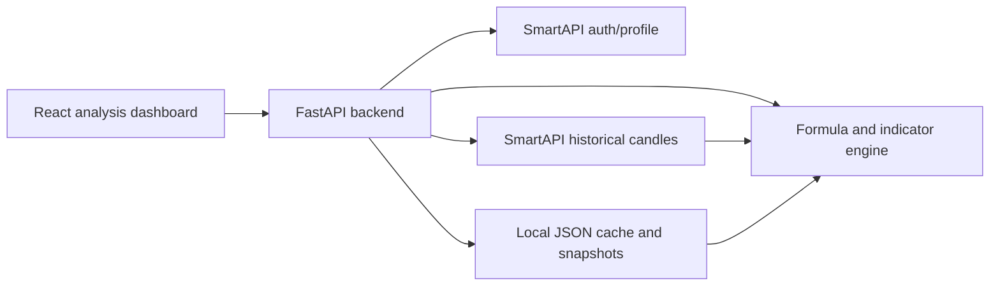

# Angel One SmartAPI Analysis Design

Last reviewed: 2026-05-12

This app is an analysis-only market research tool. It must not place, modify, cancel, or automate orders. SmartAPI is used for authenticated market data, historical candles, live feed capability, and derivative analytics where useful.

## SmartAPI Documentation Map

The SmartAPI docs at https://smartapi.angelbroking.com/docs are JavaScript-rendered, so direct static reads expose only the documentation shell. The feature map below is derived from the docs URLs, Angel One SmartAPI forum posts that quote the same endpoint specs, and the official SDK repository.

| SmartAPI area | Documentation URL | Purpose | App usage |
| --- | --- | --- | --- |
| Login and profile | https://smartapi.angelbroking.com/docs/User | `loginByPassword`, `generateTokens`, `getProfile`; returns JWT, refresh token, feed token. | Used by `/api/auth/login`, `/api/auth/refresh`, and `/api/auth/profile`. Daily login remains required because SmartAPI sessions expire around midnight. |
| Historical candles | https://smartapi.angelbroking.com/docs/Historical | `getCandleData` for OHLCV by exchange, symbol token, interval, from date, to date. | Primary source for index tracker, stock screeners, indicator calculations, and 1-year delta comparisons. Cached locally under `backend/data/candles`. |
| Historical OI | https://smartapi.angelbroking.com/docs/Historical | `getOIData` for live F&O contracts using NFO symbol token and interval. | Planned optional derivatives analysis; not part of cash/index screener scoring yet. |
| Market data quote | https://smartapi.angelbroking.com/docs/MarketData | Quote API supports LTP/OHLC/Full modes for batches of symbols. Forum notes describe up to 50 symbols per request and 1 request/second behavior. | Candidate next optimization for present-day snapshot so the dashboard can avoid one historical call per symbol. |
| Search scrip | https://smartapi.angelbroking.com/docs/MarketData | Search instruments by query instead of downloading the full master manually. | Planned for UI token lookup when sector index templates show `<token>`. |
| Gainers/Losers | https://smartapi.angelbroking.com/docs/MarketData | Derivative segment top gainers/losers: `PercPriceGainers`, `PercPriceLosers`, `PercOIGainers`, `PercOILosers`; expiry `NEAR`, `NEXT`, `FAR`. | Planned optional derivatives dashboard; not used for long-term index/stock screeners. |
| PCR | https://smartapi.angelbroking.com/docs/MarketData | Put-call ratio endpoint for options sentiment. | Planned optional market sentiment module. |
| OI buildup | https://smartapi.angelbroking.com/docs/MarketData | Long buildup, short buildup, short covering, long unwinding for derivatives. | Planned optional derivatives sentiment module. |
| Market feed WebSocket 2.0 | https://smartapi.angelbroking.com/docs/WebSocket2 | Real-time stream using JWT, API key, client code, feed token, mode, exchange type, and token list. | Not required for post-market screeners. Can be added for intraday alerts such as benchmark down 0.5%. |
| WebSocket order status | https://smartapi.angelbroking.com/docs/OrderStatus | Streams order updates. | Explicitly out of scope because this app does not trade. |
| Instruments / scrip master | https://smartapi.angelbroking.com/docs/Instruments | Master instrument list and symbol tokens. Forum references `https://margincalculator.angelbroking.com/OpenAPI_File/files/OpenAPIScripMaster.json`. | Required for complete sector/index universe and stock token lookup. Must be cached locally because the master file can be unavailable or return null. |
| Rate limits | https://smartapi.angelbroking.com/docs/RateLimit | Defines per-second, per-minute, and per-hour limits. Forum posts mention historical `getCandleData` limits and market quote 1 rps behavior. | Backend throttles historical calls and writes candle cache to avoid `Access denied because of exceeding access rate`. |
| Orders, GTT, Publisher | https://smartapi.angelbroking.com/docs/Orders, https://smartapi.angelbroking.com/docs/Gtt, https://smartapi.angelbroking.com/docs/Publisher | Trading and order/publisher workflows. | Out of scope. Do not call from this app. |

## Current Application Architecture



## Implemented SmartAPI Usage

1. Authentication:
   - UI collects API key, client code, PIN/password, TOTP, and SmartAPI headers.
   - Backend calls login, refresh, and profile endpoints.
   - No trading endpoint is called.

2. Historical analysis:
   - `/api/scan` fetches candles, builds indicators, applies structured filters and formulas, and returns read-only recommendations.
   - `/api/market-tracker` fetches selected indices/stocks once, stores a daily JSON snapshot, and returns deltas.

3. Local persistence:
   - Saved screeners are stored in `backend/data/screeners.json`.
   - Candle responses are cached in `backend/data/candles`.
   - Daily market tracker snapshots are stored in `backend/data/market_snapshots/YYYY-MM-DD.json`.

## Daily Tracker Metrics

The market tracker computes percentage change from the latest close against historical closes:

| Metric | Trading-session offset |
| --- | ---: |
| Daily | 1 |
| Weekly | 5 |
| Fortnightly | 10 |
| Monthly | 21 |
| Quarterly | 63 |
| 6 months | 126 |
| 1 year | 252 |

It also compares the current close with the previous locally stored snapshot for the same token. This gives a local run-to-run delta even if the app is refreshed multiple times after the market has closed.

## Screener Direction

The stock screener should support:

- Present-day movement: current price, previous close, day change %, range %, gap %.
- Trend filters: SMA/EMA 20/50, price vs moving average, RSI 14, volume vs 20-day average.
- History filters: distance from fetched high/low, 20-day breakout/breakdown, 1-year delta.
- Fundamental metadata supplied by user or external provider: market cap, sector, industry.
- Saved filters: reusable screen definitions with formula text and structured rules.

Example formula:

```text
Current price <= 0.50 * High price all time AND Market Capitalization > 5000
```

## News API Finding

No SmartAPI news endpoint was found in the current docs/forum material reviewed. If news-driven change attribution is required, use a separate provider and store normalized news alongside the daily snapshot:

```json
{
  "symbol": "NIFTY PHARMA",
  "date": "2026-05-12",
  "price_delta_pct": 1.2,
  "news": [
    {
      "headline": "Example sector news",
      "source": "external-provider",
      "published_at": "2026-05-12T09:30:00+05:30"
    }
  ]
}
```

## SmartAPI Gaps For Analysis Use Case

- No first-party fundamental data such as market cap, revenue, P/E, earnings, promoter holding, or debt metrics.
- No mutual fund research surface such as NAV history, AUM, expense ratio, portfolio holdings, category ranks, or benchmark mapping.
- No news endpoint found.
- Sector/index token coverage is not fully listed in stable static docs; the app needs scrip master ingestion and local override support.
- Quote API is better for today snapshots, but long period deltas still need historical candles.
- Rate limits require batching, throttling, retry/backoff, and local cache.
- Historical data may not be adjusted for corporate actions unless explicitly documented by SmartAPI; long-term backtests should treat this as a data-quality risk.

## SmartAPI Features To Add

### Must Add

1. Instrument master sync:
   - Source: Instruments docs and `OpenAPIScripMaster.json`.
   - Why: every screen, index, stock, and F&O contract depends on correct exchange tokens.
   - Implementation: nightly/manual sync to `backend/data/instruments`, indexed by exchange, token, symbol, name, instrument type, expiry, lot size, tick size.
   - UI: token search modal for stocks, indices, ETFs, and F&O contracts.
   - Current status: implemented as manual sync plus local search endpoints and dashboard search panel.

2. Search Scrip:
   - Source: MarketData docs and official forum announcement.
   - Why: faster targeted lookup when user enters `NIFTY HEALTHCARE`, `HDFCBANK-EQ`, or an option symbol.
   - Implementation: `/api/instruments/search` wrapper around `searchScrip`, falling back to local instrument cache.

3. Market quote batch endpoint:
   - Source: MarketData quote docs and forum note for `/rest/secure/angelbroking/market/v1/quote/`.
   - Why: today's LTP/OHLC snapshot should not require one historical call per instrument.
   - Implementation: batch up to the documented symbol limit and throttle at 1 request/second; use historical candles only for long deltas.

4. Historical candle scheduler/cache:
   - Source: Historical docs and rate-limit docs.
   - Why: daily, weekly, fortnightly, monthly, quarterly, 6-month, and 1-year deltas need durable OHLCV history.
   - Implementation: refresh candles once per day per token and interval; reuse cache for all comparisons and screeners.

5. Snapshot journal:
   - Source: app requirement, not SmartAPI.
   - Why: “fetch once, compare whenever app runs fresh” needs a local run history.
   - Implementation: JSON files per trading day plus symbol-token lookup for previous snapshot comparisons.

### Should Add

1. Derivatives sentiment panel:
   - Source: MarketData gainers/losers, PCR, and OI buildup APIs.
   - Why: useful context for NIFTY/BANKNIFTY/sector analysis.
   - Scope: read-only OI gainers/losers, price gainers/losers, PCR, long buildup, short buildup, short covering, long unwinding.
   - Caveat: forum reports show intermittent bad responses for some derivative endpoints; treat as advisory data with warnings.

2. Historical OI:
   - Source: Historical OI API.
   - Why: F&O users can compare price trend with OI trend.
   - Scope: optional module for NFO contracts only, not base equity analysis.

3. WebSocket market-feed alerts:
   - Source: WebSocket 2.0 docs and SDK sample.
   - Why: intraday event triggers like “NIFTY down 0.5%” are better from feed data than repeated polling.
   - Scope: alerts only; no trading or order API.

4. Rate-limit governor:
   - Source: RateLimit docs and forum reports that limits are enforced per user ID.
   - Why: multiple API keys/apps do not reliably bypass user-level throttles.
   - Scope: centralized request queue, endpoint-specific limits, retry/backoff, and non-JSON SmartAPI response handling.

### Can Add Later

1. Publisher login flow:
   - Useful if this becomes a hosted multi-user app.
   - Not needed for a personal local analysis dashboard.

2. Profile/RMS read-only account context:
   - Profile is already present.
   - RMS/holdings/positions are not needed unless the app later wants portfolio-aware analysis; still no order actions.

3. External data adapters:
   - News, fundamentals, mutual funds, corporate actions, and sector taxonomy need non-SmartAPI sources.
   - Store normalized external data beside SmartAPI snapshots so formulas can combine technical and fundamental fields.
   - Current status: Google News RSS and tracked mutual fund NAV adapter are implemented as external adapters.

## Near-Term Build Plan

1. Add scrip master ingestion and token search so all Nifty sector indices can be loaded without manual `<token>` edits.
2. Use Market Data quote API for same-day LTP/OHLC snapshot, then historical API only for periodic deltas.
3. Extend scan output with the same period deltas used by the daily tracker.
4. Add external sources for mutual funds and fundamentals.
5. Add optional external news enrichment with local JSON logs for price-move attribution.

## Source References

- SmartAPI docs root: https://smartapi.angelbroking.com/docs
- Historical docs: https://smartapi.angelbroking.com/docs/Historical
- Market data docs: https://smartapi.angelbroking.com/docs/MarketData
- Instruments docs: https://smartapi.angelbroking.com/docs/Instruments
- Rate limit docs: https://smartapi.angelbroking.com/docs/RateLimit
- Market quote forum note: https://smartapi.angelone.in/smartapi/forum/topic/4056/live-market-data-api-quote-endpoint-enhanced-with-50-symbol-bulk-fetch-and-1-request-per-second-rate-limit/1
- Historical rate-limit forum note: https://smartapi.angelone.in/smartapi/forum/topic/546/allowed-access-rate-for-historical-api
- Rate-limit table forum note: https://smartapi.angelone.in/smartapi/forum/topic/4387/changes-in-api-rate-limit/1
