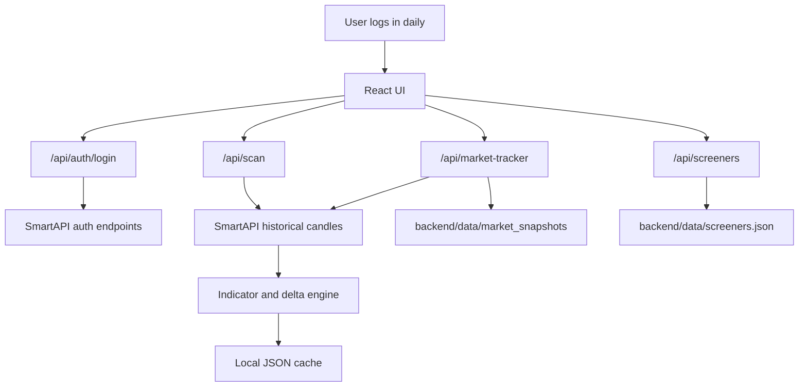

# Current Working Design

Last updated: 2026-05-12

## Product Boundary

This is an analysis-only market dashboard for Indian stocks, indices, and future mutual-fund/fundamental research. It does not place, modify, cancel, or automate trades.

The app helps with:

- Daily index and sector tracking.
- Stock/index screeners with saved filter definitions.
- Read-only SmartAPI data retrieval.
- Local JSON snapshots for comparison over time.
- Future AI-assisted explanation, ranking, and anomaly detection.

## Runtime Shape



## Authentication Flow

1. User opens the auth page.
2. User enters API key, client code, PIN/password, TOTP, and required SmartAPI headers.
3. Backend calls SmartAPI login.
4. Backend returns JWT, refresh token, feed token, session metadata, and expiry note.
5. UI unlocks the dashboard.
6. User can refresh tokens or fetch profile.

Current implementation:

- `POST /api/auth/login`
- `POST /api/auth/refresh`
- `POST /api/auth/profile`

Session note:

- SmartAPI sessions expire around midnight.
- The app expects daily login.
- Feed token is stored only for read-only feed/alert use.

## Dashboard Flow

After authentication, the dashboard contains:

- Session/profile panel.
- Index templates.
- Instrument master sync and search.
- Saved screeners.
- Status panel.
- Market all indices daily tracker.
- Mutual fund analysis.
- News feed.
- Universe query and filter form.
- Recommendation output.
- MCP capability hint.

The default watchlist contains known SmartAPI index tokens:

- NIFTY 50
- NIFTY BANK
- NIFTY FINANCIAL SERVICES
- NIFTY IT
- NIFTY PHARMA
- NIFTY FMCG
- NIFTY AUTO

Index templates are quick-add watchlist shortcuts, not guaranteed live SmartAPI tokens. Rows with `<token>` are intentionally not submitted to SmartAPI. They require instrument master lookup first.

If historical requests return `AG8001 Invalid Token`, treat it as an auth/API-key problem before debugging index symbols:

- Re-login with a fresh TOTP.
- Confirm the API key is for a Historical Data API or Market Data enabled SmartAPI app.
- Confirm the portal static IP matches the public IP sent in request headers.
- Confirm the same API key was used for login and historical requests.

## Instrument Master Flow

The instrument master fixes the placeholder-token gap for stocks, indices, ETFs, and F&O contracts.

1. User clicks `Sync master`.
2. Backend downloads Angel One's public `OpenAPIScripMaster.json`.
3. Backend normalizes and stores the data at:

```text
backend/data/instruments/scrip_master.json
```

4. User searches by symbol, name, token, or instrument type.
5. UI can add a selected instrument to the watchlist or set it as benchmark.

Current endpoints:

- `GET /api/instruments/status`
- `POST /api/instruments/sync`
- `GET /api/instruments/search`
- `GET /api/instruments/indices`

## Mutual Fund Flow

SmartAPI does not provide mutual fund research data. The app uses an external NAV adapter for tracked funds:

- HDFC Index Fund Nifty 50 Direct Growth
- HDFC Flexi Cap Fund Direct Growth
- Parag Parikh Flexi Cap Fund Direct Growth
- HDFC Small Cap Fund Direct Growth
- HDFC Mid-Cap Opportunities Fund Direct Growth

Current endpoint:

- `GET /api/mutual-funds/tracked`

The table ranks the tracked funds by 1-month NAV return and also shows 3-month, 6-month, and 1-year returns.

## News Flow

SmartAPI does not provide a news API. The app uses Google News RSS for Indian market opportunity headlines.

Current endpoint:

- `GET /api/news/market`

## Screener Flow

1. User enters or loads a watchlist.
2. Watchlist rows use this format:

```text
exchange|trading_symbol|symbol_token|display_name|sector|market_cap
```

3. User defines structured filters and optional formula text.
4. UI sends the request to `/api/scan`.
5. Backend validates tokens, skips placeholders, fetches candles, computes metrics, applies filters, sorts results, and returns read-only recommendations.

Current screener metrics include:

- Current price and previous close.
- Day change %, range %, gap %.
- Volume and 20-period average volume.
- SMA 20/50 and EMA 20/50.
- RSI 14.
- Price vs SMA 20/50.
- Fetched high/low distance.
- Trend score.
- Analysis score.
- Recommendation label and reason.

Formula examples:

```text
Current price <= 0.50 * High price all time AND Market Capitalization > 5000
```

Saved screeners are stored at:

```text
backend/data/screeners.json
```

## Market Tracker Flow

The tracker answers: “How did my index/stock universe behave across daily to yearly windows?”

1. User clicks `Refresh tracker`.
2. UI sends current watchlist symbols to `/api/market-tracker`.
3. Backend fetches historical candles with throttling/cache.
4. Backend calculates period deltas from latest close:

| Metric | Offset |
| --- | ---: |
| Daily | 1 trading session |
| Weekly | 5 trading sessions |
| Fortnightly | 10 trading sessions |
| Monthly | 21 trading sessions |
| Quarterly | 63 trading sessions |
| 6 months | 126 trading sessions |
| 1 year | 252 trading sessions |

5. Backend compares current price to the latest previous local snapshot.
6. Backend writes today’s snapshot to:

```text
backend/data/market_snapshots/YYYY-MM-DD.json
```

7. UI displays a table with daily, weekly, fortnightly, monthly, quarterly, 6M, 1Y, and snapshot deltas.

## SmartAPI Rate Handling

The SmartAPI historical path can return non-JSON rate-limit responses. The backend currently:

- Throttles historical requests.
- Retries rate-limit-like failures.
- Caches candle responses locally.
- Skips bad symbols instead of failing the whole scan.
- Returns warnings to the UI.

Known improvement:

- Add a centralized endpoint-aware request governor.
- Use Market Data quote batching for today’s LTP/OHLC.
- Use historical candles only for time-window deltas.

## Local Storage

Current local JSON storage:

| Data | Path |
| --- | --- |
| Saved screeners | `backend/data/screeners.json` |
| Candle cache | `backend/data/candles` |
| Daily market snapshots | `backend/data/market_snapshots` |

This keeps the app usable for repeated comparisons without hitting SmartAPI on every view refresh.

## Current Gaps

- Market quote batching is not implemented yet.
- Mutual fund data is not available from SmartAPI; a basic external NAV adapter is implemented, but AUM, holdings, expense ratio, and category rank still need a richer provider.
- Fundamentals are not available from SmartAPI and need an external source.
- News is not available from SmartAPI; Google News RSS is implemented for headlines, but source-level relevance scoring is still pending.
- Some sector/index tokens are still placeholders until scrip master lookup exists.
- The AI/MCP layer is described but not implemented as an MCP server yet.

## Recommended Next Implementation Order

1. Market Data quote batching for present-day values.
2. Add period deltas to screener output, not just tracker output.
3. External fundamentals adapter.
4. External mutual fund adapter.
5. External news adapter.
6. AI explanation and anomaly modules.
7. Optional WebSocket alerting for live event triggers.
