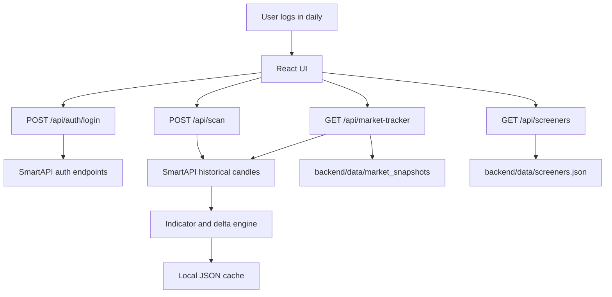

# Current Working Design

Last updated: 2026-05-12

## Product Boundary

This is an analysis-only market dashboard for Indian stocks, indices, and future mutual-fund/fundamental research. It does not place, modify, cancel, or automate trades.

The app helps with:

- Daily index and sector tracking.
- Stock/index screeners with saved filter definitions.
- Read-only SmartAPI data retrieval.
- Local JSON snapshots for comparison over time.
- Future AI-assisted explanation, ranking, and anomaly detection.

## Runtime Shape



## Authentication Flow

1. User opens the auth page.
2. User enters API key, client code, PIN/password, TOTP, and required SmartAPI headers.
3. Backend calls SmartAPI login.
4. Backend returns JWT, refresh token, feed token, session metadata, and expiry note.
5. UI unlocks the dashboard.
6. User can refresh tokens or fetch profile.

Current implementation:

- `POST /api/auth/login`
- `POST /api/auth/refresh`
- `POST /api/auth/profile`

Session note:

- SmartAPI sessions expire around midnight.
- The app expects daily login.
- Feed token is stored only for read-only feed/alert use.

## Dashboard Flow

After authentication, the dashboard contains:

- Session/profile panel.
- Index templates.
- Instrument master sync and search.
- Saved screeners.
- Status panel.
- Market all indices daily tracker.
- Mutual fund analysis.
- News feed.
- Universe query and filter form.
- Recommendation output.
- MCP capability hint.

The default watchlist contains known SmartAPI index tokens:

- NIFTY 50
- NIFTY BANK
- NIFTY FINANCIAL SERVICES
- NIFTY IT
- NIFTY PHARMA
- NIFTY FMCG
- NIFTY AUTO

## Instrument Master Flow

The instrument master fixes the placeholder-token gap for stocks, indices, ETFs, and F&O contracts.

1. User clicks `Sync master`.
2. Backend downloads Angel One's public `OpenAPIScripMaster.json`.
3. Backend normalizes and stores the data at: `backend/data/instruments/scrip_master.json`
4. User searches by symbol, name, token, or instrument type.
5. UI can add a selected instrument to the watchlist or set it as benchmark.

Current endpoints:

- `GET /api/instruments/status`
- `POST /api/instruments/sync`
- `GET /api/instruments/search`
- `GET /api/instruments/indices`

## Screener Flow

1. User enters or loads a watchlist.
2. Watchlist rows use this format:

```text
exchange|trading_symbol|symbol_token|display_name|sector|market_cap
```

3. User defines structured filters and optional formula text.
4. UI sends the request to `/api/scan`.
5. Backend validates tokens, skips placeholders, fetches candles, computes metrics, applies filters, sorts results, and returns read-only recommendations.

Current screener metrics include:

- Current price and previous close.
- Day change %, range %, gap %.
- Volume and 20-period average volume.
- SMA 20/50 and EMA 20/50.
- RSI 14.
- Price vs SMA 20/50.
- Fetched high/low distance.
- Trend score.
- Analysis score.
- Recommendation label and reason.

Formula examples:

```text
Current price <= 0.50 * High price all time AND Market Capitalization > 5000
```

Saved screeners are stored at: `backend/data/screeners.json`

## Market Tracker Flow

The tracker answers: "How did my index/stock universe behave across daily to yearly windows?"

1. User clicks `Refresh tracker`.
2. UI sends current watchlist symbols to `/api/market-tracker`.
3. Backend fetches historical candles with throttling/cache.
4. Backend calculates period deltas from latest close:

| Metric | Offset |
| --- | ---: |
| Daily | 1 trading session |
| Weekly | 5 trading sessions |
| Fortnightly | 10 trading sessions |
| Monthly | 21 trading sessions |
| Quarterly | 63 trading sessions |
| 6 months | 126 trading sessions |
| 1 year | 252 trading sessions |

5. Backend compares current price to the latest previous local snapshot.
6. Backend writes today's snapshot to: `backend/data/market_snapshots/YYYY-MM-DD.json`
